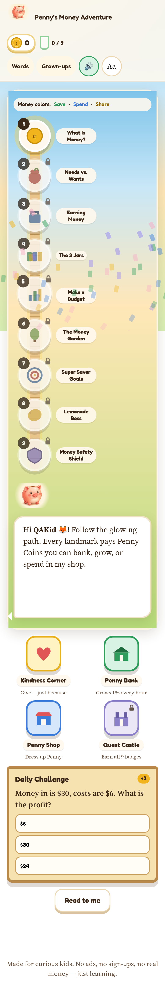
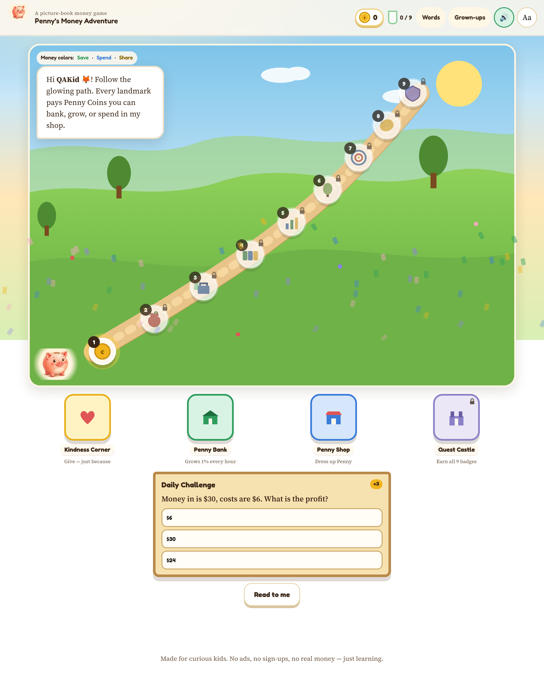

# Penny’s Money Adventure — QA Report

**Verdict:** SHIP (live Pages is the PR #4 build). Two leftover nits, not blocking, queued for a follow-up PR.

**Tester:** QA Engineer
**Product:** https://vinayakpimple.github.io/pennys-money-adventure/
**Repo:** https://github.com/vinayakpimple/pennys-money-adventure
**Save key:** `penny-save-v2`
**Report date:** Monday, August 17, 2026, 7:30 AM PT

## Live build under test

| Item | Value |
| --- | --- |
| Live URL | https://vinayakpimple.github.io/pennys-money-adventure/ |
| Main SHA | `1fd9b5d3ba6d52d412ef02c8fbec3d8ba8355c0f` |
| Merge | PR #4, 6:50 AM PT (13:50:56 UTC) |
| Pages deploy | run 32036905948 succeeded (1m9s) |
| Live Last-Modified | Mon, 17 Aug 2026 13:52:03 GMT |
| Cache-bust used | `?v=1fd9b5d3` |

## SHAs in this overnight pass

| PR | Title | Merge SHA | Merged (UTC) |
| --- | --- | --- | --- |
| #2 | Overnight fixes: name escape, landmark hits, kindness, mobile header | `e653a852166b7e2c481724e139a031d8e8ab42e5` | 2026-08-17 04:58:03 |
| #3 | Path layout: landmarks on the trail, daily card off the map | `447038a8a6f4b1d367c86709e3731734abdda04f` | 2026-08-17 12:57:50 |
| #4 | Park town buildings in a row under the map | `1fd9b5d3ba6d52d412ef02c8fbec3d8ba8355c0f` | 2026-08-17 13:50:56 |

PR #4 branch commits: `fc3f838` (buildings off the map) then `43e41dcd` (390px greeting wrap + stacked trail).

## Method

- No repo clone. Live Pages plus local PR-branch static server.
- Fresh onboarding each visual pass: clear `penny-save-v2`, name QAKid, buddy fox.
- Whole-page visual check. Widths: 390, 768, 1024, 1280, 1440.
- Functional cases scripted + playtested. Lighthouse 13.4.1 / Chrome 151 headless (lab only).

## Visual / layout (live after PR #4)

| Case | Width | Result |
| --- | --- | --- |
| Greeting readable, no mid-word clip | 390 | PASS |
| All 9 landmarks on the stacked beige trail | 390 | PASS |
| Buildings 2x2 under the map, not over greeting/path | 390 | PASS |
| Daily Challenge under buildings | 390 | PASS |
| Header / title / controls visible | 390 | PASS |
| Greeting clear in map, does not cover path | 1280 | PASS |
| Path 1–9 on the diagonal | 1280 | PASS |
| Buildings in one row under the map | 1280 | PASS |
| Daily Challenge under buildings | 1280 | PASS |
| Phone hello after the path (should greet with the start of the path) | 390 | NIT queued |
| Desktop building row narrower than the map card | 1280 | NIT queued |

### Evidence (live nits)

## Functional (PR #2, still holds on live)

| Case | Result | Notes |
| --- | --- | --- |
| Name escape | PASS | `Sam<b>X</b>ZZZZ` shown as text, no b node |
| L1 / L2 hit boxes | PASS | L1 center → #/module/what-is-money |
| Kindness re-entrancy | PASS | Double-tap Plant trees: 10 → 5 only (400ms cooldown) |
| 390px header | PASS | Title and controls visible |
| Bank floor | PASS | Full withdraw → integer 0 |
| Unknown hash | PASS | #/nope falls back to town |
| Onboarding persist | PASS | QAKid + fox, welcomed true |
| Quest Castle lock at 0/9 | PASS | Intended |

## Performance (lab, after PR #2 live SHA e653a85 — not re-run after PR #4)

| Form | Perf | A11y | BP | SEO |
| --- | --- | --- | --- | --- |
| Desktop live | 98 | 100 | 100 | 100 |
| Mobile live | 98 | 100 | 100 | 100 |
| Desktop baseline | 91 | 100 | 100 | 100 |
| Mobile baseline | 100 | 100 | 100 | 100 |

penny-idle.png is still ~1.9 MB. Not blocking on Pages.

## Open nits (Vinayak asked to push)

1. Phone hello after the path. At 390px the bubble sits at the bottom of the map card after stops 1–9. Move it so it is visible with the start of the path.
2. Desktop building row narrower than the map. At 1280px stretch the row to the map width. Keep buildings under the map.

Do not regress: buildings stay off the greeting and off the 64px landmark circles at 390 / 768 / 1024 / 1280 / 1440.

## Ship call

SHIP current live `1fd9b5d3`. Follow-up PR for the two nits; I retest those widths before that PR merges.
